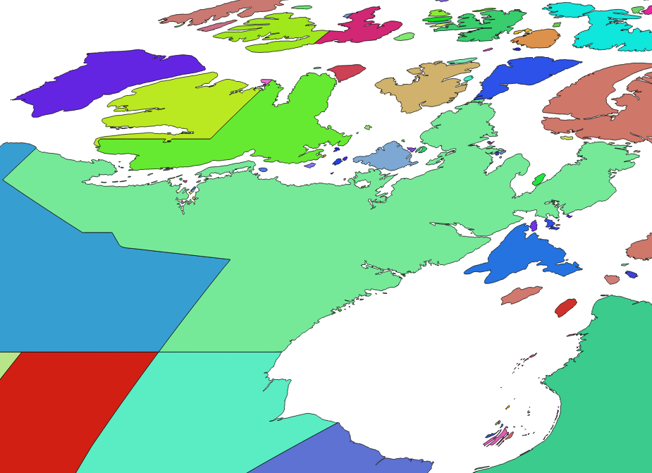

Introduction
############

Show how the sausage is made!

Wurst is a python package for linking and modifying industrial ecology models, with a focus on sparse matrices in life cycle assessment. Current development focuses on modifying the ecoinvent LCI database with scenario data from various data sources, using Brightway2 as the data backend.

See also the separate `wurst examples <https://github.com/IndEcol/wurst-examples>`__ repository.

A wurst model run will typically consist of the following steps:

* Load data from several sources
* Modify the LCI data
* Write the modified LCI data to some storage mechanism

Wurst supports the following generic modification types:

* Change the input material efficiency and associated emissions (``change_exchanges_by_constant_factor``)
* Change specific emissions separate from general efficiency improvements
* Change the relative shares of inputs (including adding new inputs) into markets
* Separate a global dataset into separate regions

In general, a modification function will include the following steps:

* Filter the LCI database by name, unit, location, etc. to get the subset of activities to modify
* Filter the external data source to get the relevant data used for modifications
* Change the values of some of the exchanges in the filtered LCI database using the filtered external data

Installation
============

Download and install `miniconda <https://conda.io/miniconda.html>`__, create and activate a `new environment <https://conda.io/docs/user-guide/tasks/manage-environments.html>`__, and then install:

.. code-block:: bash

    conda install -y -q -c conda-forge -c cmutel -c haasad -c konstantinstadler brightway2 jupyter wurst

Documents versus matrices
=========================

Inventory matrices can be modified by multiplying or adding vectors, as in the `Themis methodology paper <http://pubs.acs.org/doi/abs/10.1021/acs.est.5b01558>`__. Wurst takes a different approach - it treats each activity (column in the technosphere matrix) as a document with metadata and a list of exchanges which can be modified as desired. This approach allows for both flexibility (e.g. the number of rows and columns are not fixed) and simpler code (no need for an indirection layer to row and column indices). So, instead of constructing a vector and using it directly, wurst would prefer to write a function like:

.. code-block:: python

    import wurst as w

    def scale_biosphere_exchanges_by_delta(ds, delta):
        # Not directly related to fuel inputs
        exclude_list = [
            'Methane, fossil', 'Sulfur dioxide',
            'Carbon monoxide, fossil',
            'Nitrogen oxides', 'Dinitrogen monoxide', 'Particulates'
        ]
        for exc in w.biosphere(ds, w.doesnt_contain_any('name', exclude_list)):
            # Modifies in place
            w.rescale_exchage(exc, delta)

Internal data format
--------------------

The internal data format for Wurst is a subset of the implied internal format for Brightway2.

.. code-block:: python

    {
        'database': str,
        'code': str,
        'name': str,
        'reference product': str,
        'location': str,
        'unit': str,
        'classifications': [tuple],
        'comment': str,
        'parameters': {'parameter name (str)': float},
        'exchanges': [
            {
                'amount': float,
                'categories': list,  # only for biosphere flows
                'type': str,  # biosphere, techosphere, production
                'name': str,
                'product': str,
                'unit': str,
                'location': str,
                'input': tuple,  # only if from external database
                'uncertainty type': int,   # optional
                'loc': float,              # optional
                'scale': float,            # optional
                'shape': float,            # optional
                'minimum': float,          # optional
                'maximum': float,          # optional
                'production volume': float # optional
                'pedigree': {              # optional
                    'completeness': int,
                    'further technological correlation': int,
                    'geographical correlation': int,
                    'reliability': int,
                    'temporal correlation': int
                },
            }
        ]
    }

An example classification:

.. code-block:: python

    ('ISIC rev.4 ecoinvent', '1050:Manufacture of dairy products')

Searching and filtering
=======================

Wurst provides :ref:`helper functions <tech-searching>` to make searching and filtering easier. These filter functions are designed to be used with ``get_many`` and ``get_one``; here is an example:

.. code-block:: python

    nuclear_generation = get_many(
        lci_database,
        contains('name', 'nuclear'),
        contains('name', 'electricity'),
        equals('unit', 'kilowatt hour'),
        exclude(contains('name', 'aluminium')),
        exclude(contains('name', 'import'))
    )

It is also OK to write a generator function that does the same thing:

.. code-block:: python

    nuclear_generation = (
        ds for ds in lci_database
        if 'nuclear' in ds['name']
        and 'nuclear' in ds['name']
        and ds['unit'] == 'kilowatt hour'
        and 'aluminium' not in ds['name']
        and 'import' not in ds['name']
    )

The difference between the styles is ultimately a question of personal preference. For many people, list and generator expressions are more pythonic; in the specific case of wurst, using helper functions that are composable and reusable may allow you to not repeat yourself as often. There will also be times when the helper functions in wurst are not good enough for a specific search. In any case bear in mind the following general guidelines:

* Always manually check the results of your filtering functions before using them! The world is a complicated place, and our data sources reflect that complexity with unexpected or inconsistent elements.
* It is strongly recommended to use generator instead of list comprehensions, i.e. ``(x for x in foo)`` instead of ``[x for x in foo]``.

For more information, see the `introduction notebook <FIXME>`__, :ref:`API documentation for searching <tech-searching>`, and: `itertools <https://docs.python.org/3/library/itertools.html>`__, `functools <https://docs.python.org/3/library/functools.html>`__, `toolz <https://toolz.readthedocs.io/en/latest/index.html>`__ libraries.

Exchange iterators
------------------

The ``technosphere``, ``biosphere``, and ``production`` functions will return generators for exchanges with their respective exchange types.

Wurst also provides ``reference_product(dataset)``, which will return the single reference product for a dataset. If zero or multiple products are available, it will raise an error.

Transformations
===============

.. autofunction:: wurst.transformations.activity.change_exchanges_by_constant_factor

Unlinking and Re-linking
========================

Exchanges are considered "linked" if their input flows are already resolved to point to a certain producing activity. In Brightway2, this link is the field "input", whose value takes the form ``('database name', 'unique code')``. Wurst uses the same convention - the ``input`` field is used to uniquely identify an activity that produces the exchange flow (biosphere flows are also considered activities).

The ``output`` field is not needed - this is the activity in question, which consumes the input flow. Production exchanges will have the same value in ``input`` and ``output``.

The default Brightway2 importer will remove the ``input`` field for exchanges which are provided by another activity in the same set of input datasets. Instead of an ``input`` field, the exchange will have an activity name, a flow name, a location, and a unit. This metadata is useful if you want to edit or create new exchange links.

The Brightway2 exporter will automatically re-link (i.e. find the correct ``input`` values) exchanges when writing a new database. You can also manually create ``input`` values - no ``input`` value will be overwritten. In the database component of the ``input`` field, you can either use the name of the new database to be written, or the name of one of the input databases (it will be updated automatically).

Spatial relationships
=====================

    Topological faces in Northeastern Canada, showing both political and geographical divisions.

Wurst uses the `constructive_geometries <https://github.com/cmutel/constructive_geometries>`__ library to make spatial calculations easy. As shown above, ``constructive_geometries`` splits the world into a consistent set of `topological faces <https://postgis.net/docs/manual-2.2/Topology.html>`__, identified by integer ID values. This means that we can skip GIS functions like intersects, overlaps, etc. and instead use set algebra.

``constructive_geometries`` is based on the `natural earth database <https://www.naturalearthdata.com>`__, and includes all countries, `UN regions and subregions <https://unstats.un.org/unsd/methodology/m49/>`__, some disputed areas, and a number of ecoinvent-specific regions; for full documentation, ; see the `ecoinvent report <https://geography.ecoinvent.org/report/>`__ for a complete list. Countries are identified by their two-letter `ISO 3166-2 codes <https://en.wikipedia.org/wiki/ISO_3166-2>`__.

We recommend using the function `relink_technosphere_exchanges`, as this should be flexible enough for almost all cases, and has been tested to avoid common corner cases and possible hidden errors. See also the `Matching and linking datasets in space <https://github.com/IndEcol/wurst-examples/blob/master/introduction/Matching%20and%20linking%20datasets%20in%20space.ipynb>`__ example notebook.

.. autofunction:: wurst.transformations.geo.relink_technosphere_exchanges

Brightway2 IO
=============

.. autofunction:: wurst.brightway.extract_database.extract_brightway2_databases

.. autofunction:: wurst.brightway.write_database.write_brightway2_database

Built-in models
===============

.. toctree::
   :maxdepth: 1

   marginals

Technical documentation
=======================

.. toctree::
   :maxdepth: 1

   technical

Indices and tables
==================

* :ref:`genindex`
* :ref:`modindex`
* :ref:`search`
